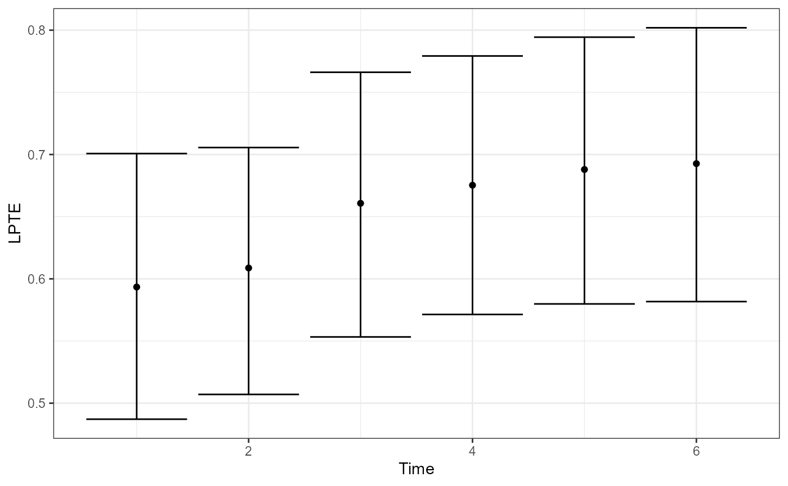
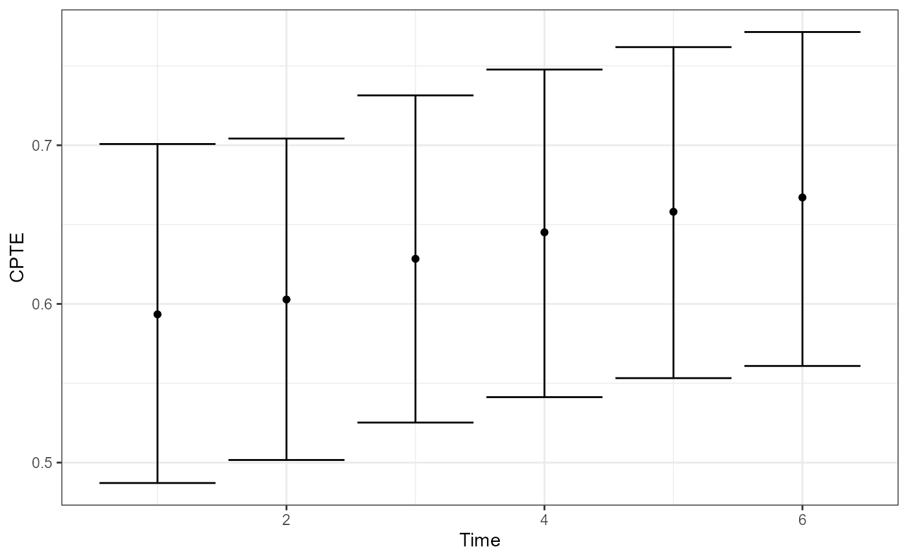
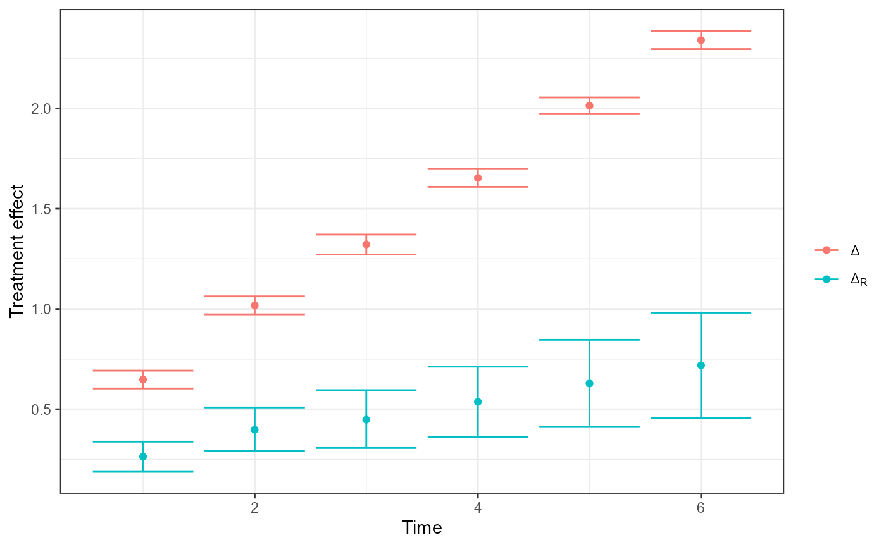

# OnlineSurr: Fitting marginal/conditional models and computing LPTE/CPTE

This vignette demonstrates the main workflow of the `OnlineSurr`
package:

1.  Prepare a longitudinal dataset with equally-spaced measurement
    times.
2.  Fit the marginal and conditional models with
    [`fit.surr()`](https://silvaneojunior.github.io/OnlineSurr/reference/fit.surr.md).
3.  Summarize results with
    [`summary()`](https://rdrr.io/r/base/summary.html), visualize with
    [`plot()`](https://rdrr.io/r/graphics/plot.default.html).
4.  Test time-homogeneity with
    [`time_homo_test()`](https://silvaneojunior.github.io/OnlineSurr/reference/time_homo_test.md).

The package returns a fitted object of class `fitted_onlinesurr` that
stores point estimates and bootstrap draws for treatment-effect
trajectories and PTE-based summaries.

## Data requirements and conventions

[`fit.surr()`](https://silvaneojunior.github.io/OnlineSurr/reference/fit.surr.md)
expects data in **long format** with one row per subject-time
measurement. Key requirements enforced by the code:

- `id` identifies subjects; there must be **at most one observation per
  subject-time** combination.
- `treat` indicates treatment assignment; it is coerced to a factor and
  is intended to represent **two treatment levels**.
- `time` must be **numeric and equally spaced** across observed time
  points. If `time` is omitted, the function creates a within-subject
  index `Time` assuming the data are already ordered and equally spaced.
- The surrogate design must not make treatment a linear combination of
  surrogate terms; otherwise the conditional model is not identifiable.

## Package functions used in this vignette

- [`fit.surr()`](https://silvaneojunior.github.io/OnlineSurr/reference/fit.surr.md)
  fits:
  - a *marginal* model producing total treatment effects $`\Delta(t)`$
  - a *conditional* model (given surrogate) producing residual treatment
    effects $`\Delta_R(t)`$
  - stores bootstrap draws for the corresponding fixed-effect
    parameters.
- [`plot.fitted_onlinesurr()`](https://silvaneojunior.github.io/OnlineSurr/reference/plot.fitted_onlinesurr.md)
  plots:
  - Local PTE: $`\text{LPTE}(t) = 1 - \Delta_R(t)/\Delta(t)`$
  - Cumulative PTE:
    $`\text{CPTE}(t) = 1 - \sum_{h\le t} \Delta_R(h) / \sum_{h\le t} \Delta(h)`$
  - Treatment effects $`\Delta(t)`$ and $`\Delta_R(t)`$
- [`time_homo_test()`](https://silvaneojunior.github.io/OnlineSurr/reference/time_homo_test.md)
  tests the hypothesis that the PTE is constant over time (implemented
  via a max-type statistic and Monte Carlo approximation of the null).

### Fitting the models with `fit.surr()`

[`fit.surr()`](https://silvaneojunior.github.io/OnlineSurr/reference/fit.surr.md)
requires:

- `formula`: outcome mean model. The function will internally add
  treatment-by-time fixed effects.
- `id`: subject identifier (unquoted).
- `treat`: treatment variable (unquoted).
- `surrogate`: surrogate structure (as a formula or a string).
- `time`: numeric time variable (unquoted).

``` r
library(OnlineSurr)
head(sim_onlinesurr)
#>   id trt time          s         y
#> 1  1   0    1 0.02116371 0.3072608
#> 2  1   0    2 0.37008517 0.7649493
#> 3  1   0    3 0.63126012 1.0500510
#> 4  1   0    4 0.79780239 1.0951569
#> 5  1   0    5 1.06470750 1.5650095
#> 6  1   0    6 1.24374405 1.4326703

fit <- fit.surr(
  formula   = y ~ 1, # baseline fixed effects; trt*time terms added internally
  id        = id,
  surrogate = ~s, # surrogate structure
  treat     = trt,
  data      = sim_onlinesurr,
  time      = time,
  N.boots   = 2000, # bootstrap draws stored in the fitted object
  verbose   = 0 # hide progress
)
```

The formulas for the fixed effects and the surrogate structures accept
any temporal structure available in the `kDGLM` package (see its
vignette for details). Functions that transform the data are also
supported.

In particular, we provide the `lagged` function, which computes lagged
values of its arguments and can be included in a model formula to
account for delayed or lingering effects of a predictor over time. We
also provide the `s` function, which generates a spline basis for a
numeric variable and can be used to model smooth, potentially non-linear
effects without having to specify the basis expansion manually.

``` r
library(OnlineSurr)

fit <- fit.surr(
  formula   = y ~ 1, # baseline fixed effects; trt*time terms added internally
  id        = id,
  surrogate = ~ s(s) + s(lagged(s, 1)) + s(lagged(s, 2)), # surrogate structure
  treat     = trt,
  data      = sim_onlinesurr,
  time      = time,
  verbose   = 0 # hide progress
)
```

#### What `fit.surr()` stores

The returned object has class `fitted_onlinesurr` and is a list with (at
least):

- `fit$T`: number of time points
- `fit$N`: number of subjects
- `fit$n.fixed`: number of fixed-effect coefficients per subject design
  (reference size)
- `fit$Marginal$point`: point estimates (vector) from the marginal model
- `fit$Marginal$smp`: bootstrap draws (matrix) from the marginal model
- `fit$Conditional$point`: point estimates (vector) from the conditional
  model
- `fit$Conditional$smp`: bootstrap draws (matrix) from the conditional
  model

The first `T` (in practice, the first `n.fixed`) elements used by
plotting/testing methods correspond to the time-indexed treatment-effect
parameters.

## Summaries and inference

### Printing a summary

The package provides an S3 summary method
[`summary.fitted_onlinesurr()`](https://silvaneojunior.github.io/OnlineSurr/reference/summary.fitted_onlinesurr.md).

- `t` selects the time index.
- `cumulative=TRUE` reports cumulative effects up to time `t` (when
  implemented by the method).
- `cumulative=FALSE` reports time-specific quantities at time `t` only.

``` r
summary(fit, t = 6, cumulative = TRUE)
#> Fitted Online Surrogate
#> 
#> Cummulated effects at time 6:
#>         Estimate Std. Error t value   Pr(>|t|)   
#> Delta    8.99606  0.05060   177.77382 0.0000e+00 ***
#> Delta.R  2.99490  0.48610     6.16108 7.2251e-10 ***
#> CPTE     0.66709  0.05387       -         -       
#> 
#> Time homogeneity test: 
#> 
#> Test stat.   Crit. value   p-value     
#>    1.05798       2.44403    0.65432    
#> ---
#> Signif. codes:  0 ‘***’ 0.001 ‘**’ 0.01 ‘*’ 0.05 ‘.’ 0.1 ‘ ’ 1
```

### Plotting LPTE, CPTE, and treatment effects

[`plot()`](https://rdrr.io/r/graphics/plot.default.html) dispatches to
[`plot.fitted_onlinesurr()`](https://silvaneojunior.github.io/OnlineSurr/reference/plot.fitted_onlinesurr.md).

``` r
plot(fit, type = "LPTE") # Local PTE over time
```



``` r
plot(fit, type = "CPTE") # Cumulative PTE over time
```



``` r
plot(fit, type = "Delta") # Delta and Delta_R over time
```



Interpretation notes:

- LPTE measures, at each time, the proportion of the total treatment
  effect explained by the surrogate, using the ratio
  $`1 - \Delta_R(t)/\Delta(t)`$.
- CPTE aggregates effects up to time $`t`$, using cumulative sums.

### Testing time-homogeneity

[`time_homo_test()`](https://silvaneojunior.github.io/OnlineSurr/reference/time_homo_test.md)
provides a max-type test, using a Monte Carlo approximation of the null
distribution.

``` r
test <- time_homo_test(fit, signif.level = 0.05, N.boots = 50000)
test
#> $T
#> [1] 1.05798
#> 
#> $T.crit
#>      95% 
#> 2.446708 
#> 
#> $p.value
#> [1] 0.65408
```

Returned components:

- `T`: observed test statistic
- `T.crit`: critical value at the requested significance level
- `p.value`: Monte Carlo p-value

## Practical tips and common pitfalls

1.  **Time index must be numeric and equally spaced.**  
    If you have missing measurements, include the missing time points
    with `NA` outcomes rather than dropping those times, so spacing
    remains consistent.

2.  **One row per subject-time.**  
    If you have duplicates, aggregate first (e.g., average within a time
    window) or decide which measurement to keep.

3.  **Bootstrap size tradeoff.**  
    `fit.surr(N.boots=...)` controls stored bootstrap draws used for
    confidence intervals associated with the treatment effect, LPTE and
    CPTE; `time_homo_test(N.boots=...)` controls Monte Carlo draws for
    the null distribution of the time homogeneity test.

See Santos Jr. and Parast (2026) for details about the theoretical
aspects of the package.

## Session info

``` r
sessionInfo()
#> R version 4.4.1 (2024-06-14 ucrt)
#> Platform: x86_64-w64-mingw32/x64
#> Running under: Windows 11 x64 (build 22631)
#> 
#> Matrix products: default
#> 
#> 
#> locale:
#> [1] LC_COLLATE=English_United States.utf8 
#> [2] LC_CTYPE=English_United States.utf8   
#> [3] LC_MONETARY=English_United States.utf8
#> [4] LC_NUMERIC=C                          
#> [5] LC_TIME=English_United States.utf8    
#> 
#> time zone: America/Chicago
#> tzcode source: internal
#> 
#> attached base packages:
#> [1] stats     graphics  grDevices utils     datasets  methods   base     
#> 
#> other attached packages:
#> [1] OnlineSurr_0.0.4
#> 
#> loaded via a namespace (and not attached):
#>  [1] sass_0.4.9          generics_0.1.3      tidyr_1.3.1        
#>  [4] stringi_1.8.4       digest_0.6.37       magrittr_2.0.3     
#>  [7] evaluate_1.0.3      grid_4.4.1          RColorBrewer_1.1-3 
#> [10] fastmap_1.2.0       jsonlite_1.8.9      extraDistr_1.10.0  
#> [13] kDGLM_1.2.14        purrr_1.0.2         scales_1.4.0       
#> [16] textshaping_1.0.0   jquerylib_0.1.4     Rdpack_2.6.2       
#> [19] cli_3.6.3           rlang_1.1.7         rbibutils_2.3      
#> [22] withr_3.0.2         cachem_1.1.0        yaml_2.3.10        
#> [25] tools_4.4.1         parallel_4.4.1      dplyr_1.1.4        
#> [28] ggplot2_4.0.1       latex2exp_0.9.6     Rfast_2.1.4        
#> [31] RcppZiggurat_0.1.6  vctrs_0.6.5         R6_2.5.1           
#> [34] lifecycle_1.0.4     stringr_1.5.1       fs_1.6.5           
#> [37] htmlwidgets_1.6.4   ragg_1.5.2          pkgconfig_2.0.3    
#> [40] desc_1.4.3          pkgdown_2.2.0       RcppParallel_5.1.10
#> [43] pillar_1.10.1       bslib_0.8.0         gtable_0.3.6       
#> [46] glue_1.8.0          Rcpp_1.0.14         systemfonts_1.2.3  
#> [49] xfun_0.50           tibble_3.2.1        tidyselect_1.2.1   
#> [52] rstudioapi_0.17.1   knitr_1.49          farver_2.1.2       
#> [55] htmltools_0.5.8.1   labeling_0.4.3      rmarkdown_2.29     
#> [58] compiler_4.4.1      S7_0.2.0
```

Santos Jr., S. V. dos, and Parast, L. (2026). [A causal framework for
evaluating jointly longitudinal outcomes and surrogate markers: A
state-space approach](https://arxiv.org/abs/2604.12882).
