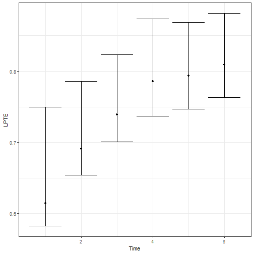
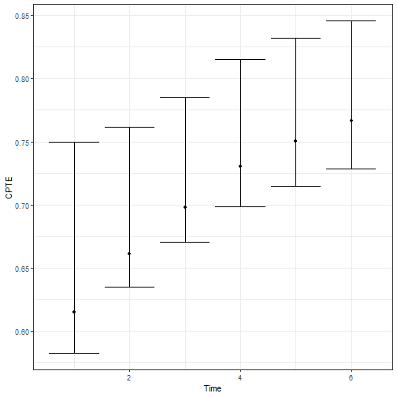
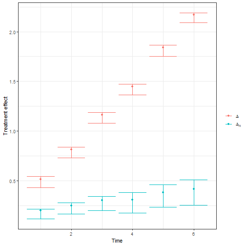

This vignette demonstrates the main workflow of the `OnlineSurr` package:

1. Prepare a longitudinal dataset with equally-spaced measurement times.
2. Fit the marginal and conditional models with `fit.surr()`.
3. Summarize results with `summary()`, visualize with `plot()`.
4. Test time-homogeneity with `time_homo_test()`.

The package returns a fitted object of class `fitted_onlinesurr` that stores point estimates and bootstrap draws for treatment-effect trajectories and PTE-based summaries.

# Data requirements and conventions

`fit.surr()` expects data in **long format** with one row per subject-time measurement. Key requirements enforced by the code:

- `id` identifies subjects; there must be **at most one observation per subject-time** combination.
- `treat` indicates treatment assignment; it is coerced to a factor and is intended to represent **two treatment levels**.
- `time` must be **numeric and equally spaced** across observed time points. If `time` is omitted, the function creates a within-subject index `Time` assuming the data are already ordered and equally spaced.
- The surrogate design must not make treatment a linear combination of surrogate terms; otherwise the conditional model is not identifiable.

# Package functions used in this vignette

- `fit.surr()` fits:
  - a *marginal* model producing total treatment effects $\Delta(t)$
  - a *conditional* model (given surrogate) producing residual treatment effects $\Delta_R(t)$
  - stores bootstrap draws for the corresponding fixed-effect parameters.
- `plot.fitted_onlinesurr()` plots:
  - Local PTE: $\text{LPTE}(t) = 1 - \Delta_R(t)/\Delta(t)$
  - Cumulative PTE: $\text{CPTE}(t) = 1 - \sum_{h\le t} \Delta_R(h) / \sum_{h\le t} \Delta(h)$
  - Treatment effects $\Delta(t)$ and $\Delta_R(t)$
- `time_homo_test()` tests the hypothesis that the PTE is constant over time (implemented via a max-type statistic and Monte Carlo approximation of the null).

# A complete worked example (simulated data)

This section builds a minimal simulated dataset consistent with the checks inside `fit.surr()`.


``` r
set.seed(1)

# Dimensions
N <- 100 # subjects
T <- 6 # time points
times <- seq_len(T) # numeric, equally spaced

# Subject IDs and treatment assignment (two levels)
id <- rep(seq_len(N), each = T)
trt <- rep(rbinom(N, 1, 0.5), each = T) # 0/1

time <- rep(times, times = N)

# Simulate surrogate(s) and outcome
# Surrogate is affected by treatment and time
s <-
  0.2 * time + # Trend
  (0.2 + 0.4 * time) * trt + # Treatment effect
  rnorm(N * T, sd = 0.1) # Noise


# Outcome depends on treatment effect, time trend, surrogate, and noise
y <-
  0.2 + # intercept
  0.1 * time + # Trend
  (0.2 + 0.1 * time) * trt + # (direct) treatment effect
  0.6 * s + # Surrogate effect
  rnorm(N * T, sd = 0.1) # Noise

dat <- data.frame(
  id = id,
  trt = trt,
  time = time,
  s = s,
  y = y
)

# Ensure the data are ordered by (id, time) (recommended)
dat <- dat[order(dat$id, dat$time), ]
head(dat)
#>   id trt time         s         y
#> 1  1   0    1 0.2398106 0.4499785
#> 2  1   0    2 0.3387974 0.5209293
#> 3  1   0    3 0.6341120 1.0634402
#> 4  1   0    4 0.6870637 0.8692466
#> 5  1   0    5 1.1433024 1.4113951
#> 6  1   0    6 1.3980400 1.3448466
```

## Fitting the models with `fit.surr()`

`fit.surr()` requires:

- `formula`: outcome mean model. The function will internally add treatment-by-time fixed effects.
- `id`: subject identifier (unquoted).
- `treat`: treatment variable (unquoted).
- `surrogate`: surrogate structure (as a formula or a string).
- `time`: numeric time variable (unquoted).


``` r
library(OnlineSurr)

fit <- fit.surr(
  formula   = y ~ 1, # baseline fixed effects; trt*time terms added internally
  id        = id,
  surrogate = ~s, # surrogate structure
  treat     = trt,
  data      = dat,
  time      = time,
  N.boots   = 2000, # bootstrap draws stored in the fitted object
  verbose   = 0 # hide progress
)
```

The formulas for the fixed effects and the surrogate structures accept any temporal structure available in the `kDGLM` package (see its vignette for details). Functions that transform the data are also supported.

In particular, we provide the `lagged` function, which computes lagged values of its arguments and can be included in a model formula to account for delayed or lingering effects of a predictor over time. We also provide the `s` function, which generates a spline basis for a numeric variable and can be used to model smooth, potentially non-linear effects without having to specify the basis expansion manually.


``` r
library(OnlineSurr)

fit <- fit.surr(
  formula   = y ~ 1, # baseline fixed effects; trt*time terms added internally
  id        = id,
  surrogate = ~ s(s) + s(lagged(s, 1)) + s(lagged(s, 2)), # surrogate structure
  treat     = trt,
  data      = dat,
  time      = time,
  verbose   = 0 # hide progress
)
```

### What `fit.surr()` stores

The returned object has class `fitted_onlinesurr` and is a list with (at least):

- `fit$T`: number of time points
- `fit$N`: number of subjects
- `fit$n.fixed`: number of fixed-effect coefficients per subject design (reference size)
- `fit$Marginal$point`: point estimates (vector) from the marginal model
- `fit$Marginal$smp`: bootstrap draws (matrix) from the marginal model
- `fit$Conditional$point`: point estimates (vector) from the conditional model
- `fit$Conditional$smp`: bootstrap draws (matrix) from the conditional model

The first `T` (in practice, the first `n.fixed`) elements used by plotting/testing methods correspond to the time-indexed treatment-effect parameters.

# Summaries and inference

## Printing a summary

The package provides an S3 summary method `summary.fitted_onlinesurr()`.

- `t` selects the time index.
- `cumulative=TRUE` reports cumulative effects up to time `t` (when implemented by the method).
- `cumulative=FALSE` reports time-specific quantities at time `t` only.


``` r
summary(fit, t = 6, cumulative = TRUE)
#> Fitted Online Surrogate
#> 
#> Cummulated effects at time 6:
#>         Estimate Std. Error t value  Pr(>|t|)   
#> Delta    7.94053  0.08800   90.23486 0.0000e+00 ***
#> Delta.R  1.85514  0.22958    8.08060 6.6613e-16 ***
#> CPTE     0.76637  0.02954      -         -       
#> 
#> Time homogeneity test: 
#> 
#> Test stat.   Crit. value   p-value     
#>    2.19913       2.51935    0.11282    
#> ---
#> Signif. codes:  0 ‘***’ 0.001 ‘**’ 0.01 ‘*’ 0.05 ‘.’ 0.1 ‘ ’ 1
```

## Plotting LPTE, CPTE, and treatment effects

`plot()` dispatches to `plot.fitted_onlinesurr()`.


``` r
plot(fit, type = "LPTE") # Local PTE over time
```



``` r
plot(fit, type = "CPTE") # Cumulative PTE over time
```



``` r
plot(fit, type = "Delta") # Delta and Delta_R over time
```



Interpretation notes:

- LPTE measures, at each time, the proportion of the total treatment effect explained by the surrogate, using the ratio $1 - \Delta_R(t)/\Delta(t)$.
- CPTE aggregates effects up to time $t$, using cumulative sums.

## Testing time-homogeneity

`time_homo_test()` provides a max-type test, using a Monte Carlo approximation of the null distribution.


``` r
test <- time_homo_test(fit, signif.level = 0.05, N.boots = 50000)
test
#> $T
#> [1] 2.199127
#> 
#> $T.crit
#>     95% 
#> 2.51428 
#> 
#> $p.value
#> [1] 0.1084
```

Returned components:

- `T`: observed test statistic
- `T.crit`: critical value at the requested significance level
- `p.value`: Monte Carlo p-value

# Practical tips and common pitfalls

1. **Time index must be numeric and equally spaced.**  
   If you have missing measurements, include the missing time points with `NA` outcomes rather than dropping those times, so spacing remains consistent.

2. **One row per subject-time.**  
   If you have duplicates, aggregate first (e.g., average within a time window) or decide which measurement to keep.

3. **Bootstrap size tradeoff.**  
   `fit.surr(N.boots=...)` controls stored bootstrap draws used for confidence intervals associated with the treatment effect, LPTE and CPTE; `time_homo_test(N.boots=...)` controls Monte Carlo draws for the null distribution of the time homogeneity test.

# Session info


``` r
sessionInfo()
#> R version 4.4.1 (2024-06-14 ucrt)
#> Platform: x86_64-w64-mingw32/x64
#> Running under: Windows 11 x64 (build 22631)
#> 
#> Matrix products: default
#> 
#> 
#> locale:
#> [1] LC_COLLATE=English_United States.utf8  LC_CTYPE=English_United States.utf8    LC_MONETARY=English_United States.utf8
#> [4] LC_NUMERIC=C                           LC_TIME=English_United States.utf8    
#> 
#> time zone: America/Chicago
#> tzcode source: internal
#> 
#> attached base packages:
#> [1] stats     graphics  grDevices utils     datasets  methods   base     
#> 
#> other attached packages:
#> [1] OnlineSurr_0.0.0
#> 
#> loaded via a namespace (and not attached):
#>  [1] gtable_0.3.6        xfun_0.50           ggplot2_4.0.1       htmlwidgets_1.6.4   devtools_2.4.5     
#>  [6] remotes_2.5.0       processx_3.8.5      callr_3.7.6         ps_1.8.1            vctrs_0.6.5        
#> [11] tools_4.4.1         Rdpack_2.6.2        generics_0.1.3      parallel_4.4.1      tibble_3.2.1       
#> [16] pkgconfig_2.0.3     R.oo_1.27.0         RColorBrewer_1.1-3  S7_0.2.0            desc_1.4.3         
#> [21] RcppParallel_5.1.10 lifecycle_1.0.4     R.cache_0.16.0      compiler_4.4.1      farver_2.1.2       
#> [26] stringr_1.5.1       httpuv_1.6.15       htmltools_0.5.8.1   usethis_3.1.0       yaml_2.3.10        
#> [31] later_1.4.1         pillar_1.10.1       urlchecker_1.0.1    tidyr_1.3.1         ellipsis_0.3.2     
#> [36] R.utils_2.12.3      cachem_1.1.0        sessioninfo_1.2.2   mime_0.12           styler_1.10.3      
#> [41] tidyselect_1.2.1    digest_0.6.37       stringi_1.8.4       dplyr_1.1.4         purrr_1.0.2        
#> [46] labeling_0.4.3      latex2exp_0.9.6     rprojroot_2.0.4     fastmap_1.2.0       grid_4.4.1         
#> [51] cli_3.6.3           magrittr_2.0.3      Rfast_2.1.4         pkgbuild_1.4.6      withr_3.0.2        
#> [56] scales_1.4.0        promises_1.3.2      RcppZiggurat_0.1.6  roxygen2_7.3.3      extraDistr_1.10.0  
#> [61] R.methodsS3_1.8.2   memoise_2.0.1       shiny_1.10.0        kDGLM_1.2.14        evaluate_1.0.3     
#> [66] knitr_1.49          rbibutils_2.3       miniUI_0.1.1.1      profvis_0.4.0       rlang_1.1.7        
#> [71] Rcpp_1.0.14         xtable_1.8-4        glue_1.8.0          xml2_1.3.6          pkgload_1.4.0      
#> [76] rstudioapi_0.17.1   R6_2.5.1            fs_1.6.5
```
